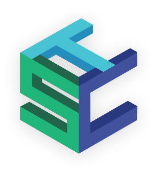
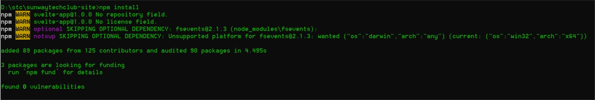

<p align="center">
  <a href="" rel="noopener">
 </a>
</p>

<h3 align="center">Sunway Tech Club Official Website</h3>


---

<p align="center"> This is the repo for Sunway Tech Club official website, written with Sveltejs
    <br> 
</p>

## 📝 Table of Contents

- [Getting Started](#getting_started)
- [Deployment](#deployment)
- [Built Using](#built_using)
- [Contributing](#Contributing)

## 🏁 Getting Started <a name = "getting_started"></a>

These instructions will get you a copy of the project up and running on your local machine for development and testing purposes. See [deployment](#deployment) for notes on how to deploy the project on a live system.

### Prerequisites

To get it up and running, you will need to have [Nodejs](https://nodejs.org/en/download/)

After you had installed Nodejs, you will need to install [Git](https://git-scm.com/).

### Installing

This is a step by step to get this repository on your local machine

First, clone this repo using your terminal (cmd or bash 👀)

```
git clone https://github.com/sunwaytechclub/sunwaytechclub-site.git
```

And then walk into the folder ( [click here if you do not know how to](https://www.digitalcitizen.life/command-prompt-how-use-basic-commands) ), and install all the dependencies by running in the folder

```
npm install
```

This will be roughly what you will see:



It should show no error.

If you are facing any problem in installing, do open an issue [here](https://github.com/sunwaytechclub/sunwaytechclub-site/issues)

## 🔧 Running the tests <a name = "tests"></a>

Run this when you need to test out the website, but this command will not response anything for now 🥱.

```
npm run test
```

## 🚀 Deployment <a name = "deployment"></a>

Simply run

```
npm run build
```

To generate all the bundled files in `/public` folder.

## ⛏️ Built Using <a name = "built_using"></a>

- [MongoDB](https://www.mongodb.com/) - Database
- [Express](https://expressjs.com/) - Server Framework
- [Sveltejs](https://svelte.dev/) - Web Framework
- [NodeJs](https://nodejs.org/en/) - Server Environment

## 🎉 Contribute <a name = "Contributing"></a>

To contribute (yay thanks in advance), see [here](https://github.com/sunwaytechclub/sunwaytechclub-site/blob/master/CONTRIBUTE.md)
